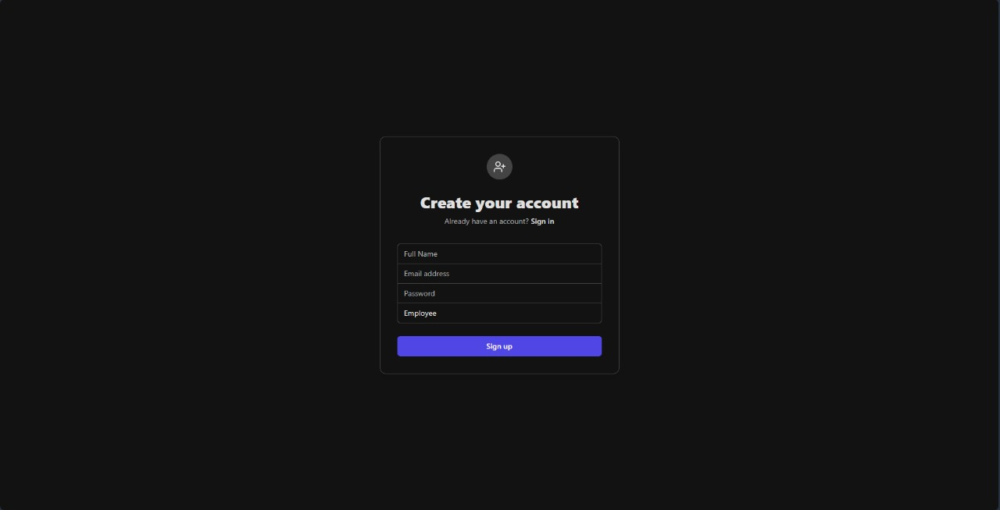
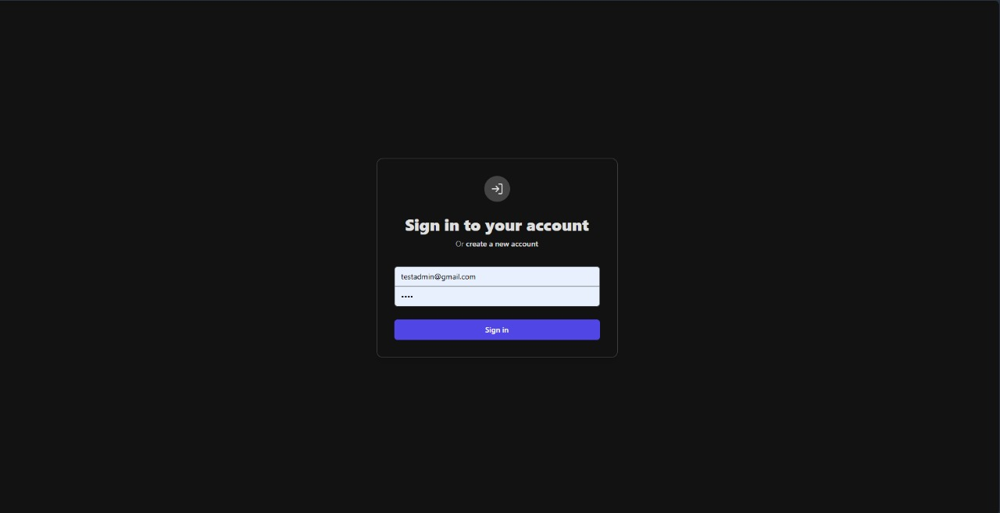
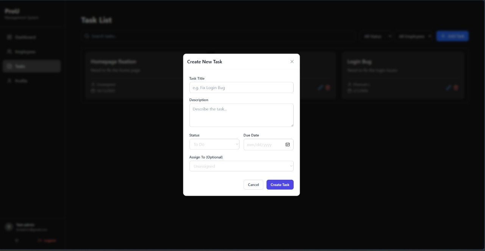
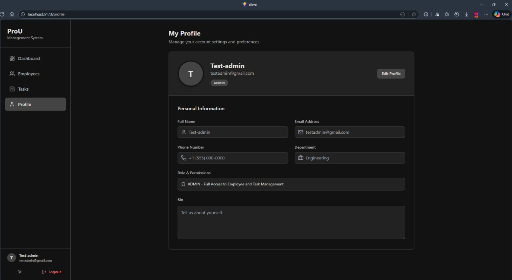
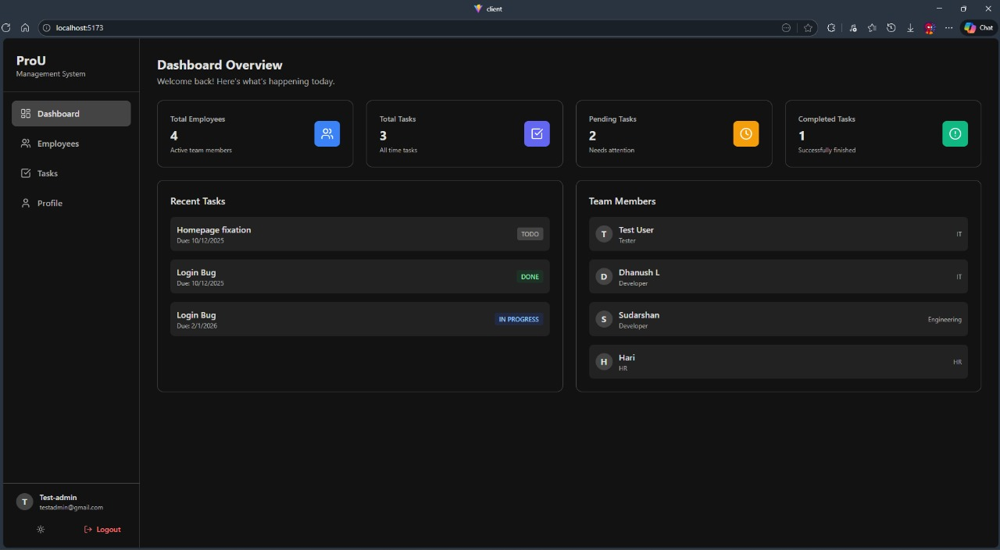
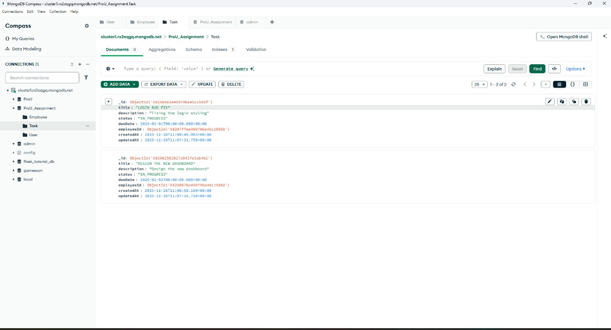
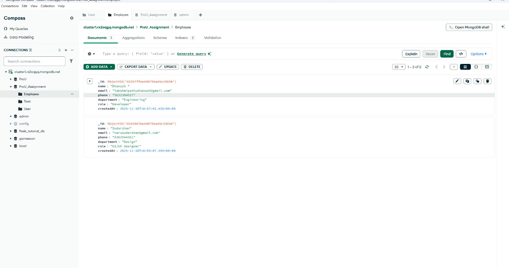
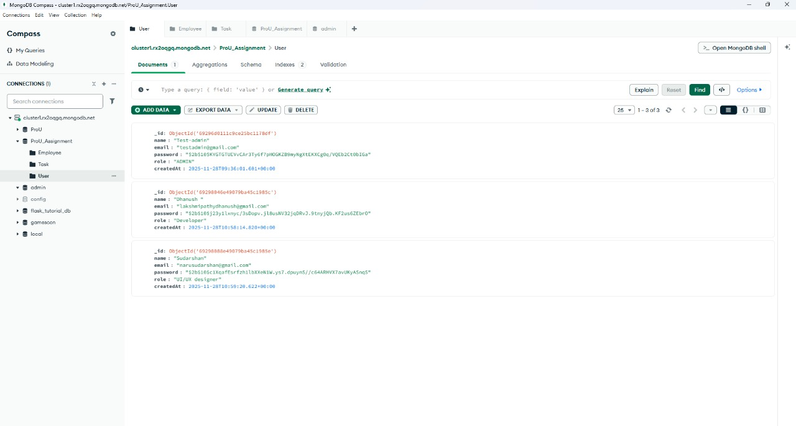

# ProU Assignment - Employee & Task Management System

A full-stack application for managing employees and tasks, built with a modern tech stack and a focus on user experience. This project demonstrates a complete workflow from authentication to data management with a responsive and accessible UI.

## 🚀 Key Features

### 🔐 Authentication & Security
-   **Secure Login/Signup**: User registration and login using JWT (JSON Web Tokens).
-   **Role-Based Access Control (RBAC)**:
    -   **Admin**: Full access to manage employees and tasks.
    -   **Employee**: Restricted access to view tasks and update their own profile.
-   **Protected Routes**: Secure navigation guards to prevent unauthorized access.

### 👥 Employee Management
-   **CRUD Operations**: Add, view, update, and delete employee records.
-   **Search & Filter**: Real-time search functionality to find employees quickly.
-   **Profile Management**: Users can update their personal details (Phone, Department, Bio).

### 📋 Task Management
-   **Task Tracking**: Create, assign, and track tasks.
-   **Status Updates**: Manage task progress (TODO, IN_PROGRESS, DONE).
-   **Visual Indicators**: Color-coded status badges for easy scanning.

### 🎨 UI/UX & Design
-   **Dashboard**: A visual overview of key metrics (Total Employees, Tasks, Pending/Completed counts).
-   **Dark Mode**: Fully integrated dark theme with a toggle switch, persisting user preference.
-   **Responsive Design**: Mobile-first approach ensuring usability across all devices.
-   **Modern Aesthetics**: Clean interface built with Tailwind CSS and Lucide icons.

## 🛠️ Tech Stack

### Frontend
-   **Framework**: React (Vite)
-   **Styling**: Tailwind CSS
-   **Routing**: React Router DOM
-   **HTTP Client**: Axios
-   **Icons**: Lucide React
-   **State Management**: React Context API (Auth & Theme)

### Backend
-   **Runtime**: Node.js
-   **Framework**: Express.js
-   **Database**: MongoDB
-   **ORM**: Prisma
-   **Authentication**: JSON Web Tokens (JWT) & Bcrypt

## ⚙️ Setup Instructions

### Prerequisites
-   Node.js (v16 or higher)
-   MongoDB (Local or Atlas connection string)

### 1. Clone the Repository
```bash
git clone <repository-url>
cd ProU_Assignment
```

### 2. Backend Setup
Navigate to the server directory:
```bash
cd server
```

Install dependencies:
```bash
npm install
```

Configure Environment:
Create a `.env` file in the `server` directory (optional if using defaults, but recommended):
```env
DATABASE_URL="mongodb+srv://<username>:<password>@cluster.mongodb.net/prou_db"
JWT_SECRET="your-secret-key"
PORT=5000
```

Initialize Database:
```bash
npx prisma generate
```

Start the Server:
```bash
npm run dev
# Server runs on http://localhost:5000
```

### 3. Frontend Setup
Open a new terminal and navigate to the client directory:
```bash
cd client
```

Install dependencies:
```bash
npm install
```

Start the Development Server:
```bash
npm run dev
# Client runs on http://localhost:5173
```

## 📚 API Endpoints

### Authentication
-   `POST /api/auth/register` - Create a new account
-   `POST /api/auth/login` - Sign in
-   `GET /api/auth/profile` - Get current user profile
-   `PUT /api/auth/profile` - Update user profile

### Employees
-   `GET /api/employees` - List all employees
-   `POST /api/employees` - Add a new employee
-   `PUT /api/employees/:id` - Update employee details
-   `DELETE /api/employees/:id` - Remove an employee

### Tasks
-   `GET /api/tasks` - List all tasks
-   `POST /api/tasks` - Create a new task
-   `PUT /api/tasks/:id` - Update task status/details
-   `DELETE /api/tasks/:id` - Delete a task
-   
### TEST ACCOUNTS
    Email:testadmin@gmail.com
    password:test
    ----------------------
    Email:testuser1@gmail.com
    password:test
  
## 📸 Screenshots
### Main UI Screens
<p float="left">
  
  
  
  
  
</p>

### MongoDB Screens
<p float="left">
  
  
  
</p>

-   **Database**: MongoDB was chosen for its flexibility with JSON-like documents, fitting well with the Node.js ecosystem.
-   **Styling**: Tailwind CSS was selected for its utility-first approach, enabling rapid UI development and easy dark mode implementation.
-   **State**: Used React Context for global state (Auth, Theme) to avoid prop drilling, keeping the architecture simple without Redux.
